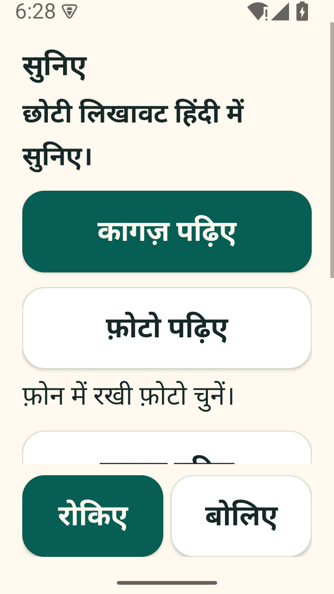

# सुनिए / Suniye

Suniye is an Android reading aid built for my mother and father, who have weak eyesight and use Redmi A4 phones. They ask me to read WhatsApp messages, pictures, labels and documents. It helps Hindi readers who struggle with small print hear the message or paper they have in front of them. The app uses large Hindi controls: listen, stop, listen again, slow down and explain. Optional बोलिए adds short spoken Hindi commands after caregiver setup.

This is a pilot for Android 11 and later. Original text from Android or bundled on-device OCR is read with an installed offline Hindi voice. Uncertain OCR asks for a retake. Gemma provides separate Hindi explanations and can describe non-text pictures through a configured backend. Picture descriptions need more work: local tests identified colors but described a square less precisely as a rectangle, and another configuration omitted positions. Some earlier runs retook or timed out. Maithili and real family-phone usability are unverified.



## Try the pilot

After the caregiver completes setup, the home screen offers कागज़ पढ़िए for the camera, फ़ोटो पढ़िए for a selected image, फ़ाइल पढ़िए for a PDF, and WhatsApp से सुनिए. In WhatsApp, open the message and tap the floating सुनिए control. For a photo or PDF, Share → Suniye is another route. The WhatsApp button explains these steps before opening the app. Repeat, slower playback and explanation appear once a reading exists; रोकिए stays outside the scrolling content. Reopening an old share from Recents does not automatically read it again.

Tap बोलिए, wait for the beep, and say पढ़िए, फिर सुनिए, धीरे सुनिए or रोकिए. कागज़ पढ़िए opens the camera; फोटो लो captures there. The microphone runs for one short foreground attempt, with a fixed Stop button. It is off by default. On-device recognition is preferred; an approved standard phone service may use the internet. Commands and audio are not stored by Suniye. Parser and synthetic callback tests do not establish real Hindi recognition on a Redmi.

Amounts have a separate Hindi pronunciation: `₹1,250` is spoken as “एक हज़ार दो सौ पचास रुपये.” The reading screen shows that amount in words alongside the unchanged original. Both the Android voice input and the online provider use the same tested rules. Dates keep their written field order; labelled PINs and phone numbers are read digit by digit. These checks verify the speech input, not a listening result on the parents’ phones.

[Download the pilot APK](https://github.com/himanshu748/suniye/releases/download/v0.1.0-pilot/suniye-debug.apk). A caregiver must install it, obtain the parent's agreement, enable accessibility for Suniye and install an offline Hindi TTS voice. See [caregiver setup](docs/caregiver-setup.md). Accessibility grants access to visible screen content after a deliberate tap. Never bypass protected screens or disable Play Protect to install it.

Text reading works without a backend. Images use bundled Devanagari and Latin OCR first. Descriptions and explanations need an accessible Gemma backend. Provider keys stay on that backend. Optional online narration starts only after the caregiver enables it. Offline Hindi voice availability and audible number pronunciation must be checked on each phone.

The debug pilot contains a synthetic fixture and test instrumentation; release builds exclude those. The debug overlay also permits the app's own package so its capture path can be tested. In release source, the overlay permits WhatsApp and WhatsApp Business only. This APK has not been tested in the parents' WhatsApp installations. Android 11–13 image capture requests a retake if the overlay obscures the media; opening the image directly in Suniye avoids that control.

## Build and run

Android requires JDK 17, Android SDK 36 and the checked-in Gradle wrapper:

```sh
cd android
./gradlew assembleDebug
```

Run the backend with Node 22 or later and a local Ollama Gemma 3 model:

```sh
ollama pull gemma3:4b
cd backend
npm ci
cp .env.example .env
# Set a random FAMILY_TOKEN in .env before starting.
npm start
npm test
```

The model weights are about 3.3 GB on the development laptop. They are not bundled in the roughly 51 MB APK. Use a token-protected HTTPS backend for remote phones. A USB debug connection can use `adb reverse`; instructions are in the caregiver guide. The Render blueprint uses the current repository's `outputs/suniye/backend` directory and a free instance by default; a hosted Gemma endpoint must be configured separately.

## Data and limitations

The backend does not archive reading requests. Mastra snapshot persistence and content logging are disabled. Optional Atlas sync stores preferences only. Optional Sentry traces keep stage/model/token metadata and discard prompts, reading text and identifiers before transmission; Sentry may add network-derived metadata. The phone privately stores the last reading and optional MP3 for Repeat; the caregiver can delete them. Device backup is disabled.

OCR and explanations can be wrong. A confidence threshold is a retake heuristic, not an accuracy guarantee. In one synthetic bill, both early generative OCR and bundled OCR misread words. The app now rejects the known low-confidence OCR case and prohibits Gemma from supplying guessed image text. Important amounts, dates and medicine labels still need a family member's check.

[Verification](docs/verification.md) records real tests and failures. [Sponsor evidence](docs/sponsor-tracks.md) distinguishes working use, implemented modules and pending live checks. [Local model comparison](docs/model-evaluation.md), [Claude audit](docs/claude-audit.md) and [Entire provenance](docs/build-provenance.md) explain the review and decisions.

Suniye's code is MIT licensed. Gemma model weights have separate Gemma terms; Google's bundled ML Kit OCR is a proprietary SDK. Mastra and other dependencies retain their own licenses. See [third-party notes](docs/third-party.md).

## Challenge demo and release evidence

[Recorded pilot demo (voice: elevenlabs.io)](https://github.com/himanshu748/suniye/releases/download/v0.1.0-pilot/suniye-demo-simple.mp4) shows one task: open a synthetic electricity bill, hear ₹1,250 as Hindi words, repeat it and stop. A short Hindi purpose narration explains who the app helps. The recording uses actual Android controls and Raju v4 provider audio, mixed separately because Android screenrecord has no device sound. See [recording notes](docs/demo-script.md). Older model and Slow evidence remains dated supplementary material. Voice recognition is not staged in the film.

The private backend now uses Raju v4 after the user redeemed the partner Creator plan. V4's free web/mobile promotion does not cover API calls; the API uses account credits. The app's optional online voice remains off until caregiver consent. Earlier Roger and rejected own-voice trials are retained as dated evidence, with their limitations.

The challenge deadline is October 5 at 12:29 PM IST. Repository and demo publication are tracked in the October 4 readiness receipt; the [DEV entry is published](https://dev.to/himanshu_748/suniye-let-my-parents-hear-the-message-themselves-41bh). The family handover is bonus evidence under the rules; physical-phone testing remains important for the pilot but is not a required contest submission gate.

The [image/PDF walkthrough](https://github.com/himanshu748/suniye/releases/download/v0.1.0-pilot/suniye-demo-media.mp4) shows synthetic Android Share inputs, bundled OCR, live Hindi audio and two PDF pages. Its WhatsApp section shows Suniye’s help screen. The [sample image](docs/evidence/media-sample-image.png) and [two-page PDF](docs/evidence/media-sample-two-pages.pdf) are included. Actual WhatsApp and Redmi tests remain pending.

[Complete judge walkthrough](https://github.com/himanshu748/suniye/releases/download/v0.1.0-pilot/suniye-demo-judge.mp4) combines the bill and media recordings, shows source files first, and includes a separate saved Gemma/Mastra result. [Editing checks](docs/evidence/judge-demo-edit-2026-10-04.json).

October 4 additional live checks: [Render](docs/evidence/render-live-2026-10-04.json) serves authenticated original reading with Raju speech; [Sentry](docs/evidence/sentry-live-2026-10-04.json) displays local Gemma agent/model timing; [Backboard](docs/evidence/backboard-comparison.json) compares six synthetic explanations. These are separate from physical-phone usability.
