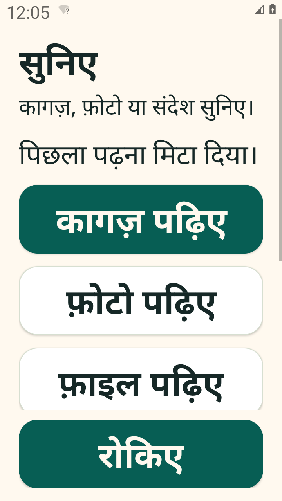

# सुनिए / Suniye

Suniye is an Android reading aid built for my mother and father, who have weak eyesight and use Redmi A4 phones. They ask me to read WhatsApp messages, pictures, labels and documents. The app uses large Hindi controls: listen, stop, listen again, slow down and explain.

This is a pilot for Android 11 and later. Original text from Android or bundled on-device OCR is read with an installed offline Hindi voice. Uncertain OCR asks for a retake. Gemma provides separate Hindi explanations and can describe non-text pictures through a configured backend. Picture descriptions need more work: local tests identified colors but described a square less precisely as a rectangle, and another configuration omitted positions. Some earlier runs retook or timed out. Maithili and real family-phone usability are unverified.



## Try the pilot

After the caregiver completes setup, the home screen offers कागज़ पढ़िए for the camera, फ़ोटो पढ़िए for a selected image, फ़ाइल पढ़िए for a PDF, and WhatsApp खोलिए. In WhatsApp, open the message or picture and tap the Suniye overlay. Android Share → Suniye is another route. Repeat, slower playback and explanation appear once a reading exists; रोकिए stays outside the scrolling content. Reopening an old share from Recents does not automatically read it again.

The debug APK is prepared as a separate release asset named `suniye-debug.apk`; binary releases are excluded from this source snapshot. A caregiver must install it, obtain the parent's agreement, enable accessibility for Suniye and install an offline Hindi TTS voice. See [caregiver setup](docs/caregiver-setup.md). Accessibility grants access to visible screen content after a deliberate tap. Never bypass protected screens or disable Play Protect to install it.

Text reading works without a backend. Images use bundled Devanagari and Latin OCR first. Descriptions and explanations need an accessible Gemma backend. Provider keys stay on that backend. Optional online narration starts only after the caregiver enables it. Offline Hindi voice availability and audible number pronunciation must be checked on each phone.

The debug pilot contains a synthetic fixture and test instrumentation; release builds exclude those. The debug overlay also permits the app's own package so its capture path can be tested. In release source, the overlay permits WhatsApp and WhatsApp Business only. This APK has not been tested in the parents' WhatsApp installations. Android 11–13 image capture requests a retake if the overlay obscures the media; opening the image directly in Suniye avoids that control.

## Build and run

Android requires JDK 17, Android SDK 36 and the checked-in Gradle wrapper:

```sh
cd android
./gradlew assembleDebug
```

Run the backend with Node 22 or later and a local Ollama Gemma 3 model:

```sh
ollama pull gemma3:4b
cd backend
npm ci
cp .env.example .env
# Set a random FAMILY_TOKEN in .env before starting.
npm start
npm test
```

The model weights are about 3.3 GB on the development laptop. They are not bundled in the roughly 51 MB APK. Use a token-protected HTTPS backend for remote phones. A USB debug connection can use `adb reverse`; instructions are in the caregiver guide. The Render blueprint uses the current repository's `outputs/suniye/backend` directory and a free instance by default; a hosted Gemma endpoint must be configured separately.

## Data and limitations

The backend does not archive reading requests. Mastra snapshot persistence and content logging are disabled. Optional Atlas sync stores preferences only. Optional Sentry traces keep stage/model/token metadata and discard prompts, reading text and identifiers. The phone privately stores the last reading and optional MP3 for Repeat; the caregiver can delete them. Device backup is disabled.

OCR and explanations can be wrong. A confidence threshold is a retake heuristic, not an accuracy guarantee. In one synthetic bill, both early generative OCR and bundled OCR misread words. The app now rejects the known low-confidence OCR case and prohibits Gemma from supplying guessed image text. Important amounts, dates and medicine labels still need a family member's check.

[Verification](docs/verification.md) records real tests and failures. [Sponsor evidence](docs/sponsor-tracks.md) distinguishes working use, implemented modules and pending live checks. [Local model comparison](docs/model-evaluation.md), [Claude audit](docs/claude-audit.md) and [Entire provenance](docs/build-provenance.md) explain the review and decisions.

Suniye's code is MIT licensed. Gemma model weights have separate Gemma terms; Google's bundled ML Kit OCR is a proprietary SDK. Mastra and other dependencies retain their own licenses. See [third-party notes](docs/third-party.md).

## Challenge demo and release evidence

The recorded pilot demo (voice: elevenlabs.io), prepared as a separate `suniye-demo.mp4` release asset, uses actual emulator controls and synthetic material. The English overview and real Hindi API audio are mixed separately; it is not a device audio recording. The film retains a Gemma explanation refusal and the original's replay. See [entry readiness](docs/evidence/entry-readiness-2026-10-03.md) and [recording notes](docs/demo-script.md).

The publication tree and local DEV draft are prepared for the challenge deadline, October 5 at 12:29 PM IST. Public source/demo links and the posted article still need final publication and readback. The family handover is bonus evidence under the rules; physical-phone testing remains important for the pilot but is not a required contest submission gate.
